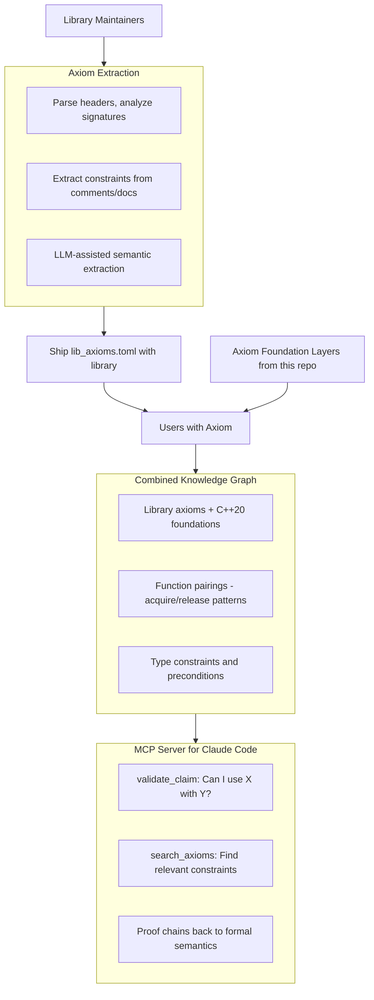

# Axiom: Grounded Truth Validation for LLMs

[](https://github.com/mattyv/axiom/actions/workflows/ci.yml)


**Automatically build knowledge about your C++20 libraries so LLMs stop hallucinating about them so much.**

## The Problem

LLMs hallucinate about library code because they have no grounding in your library's actual constraints. When an LLM says "you can use `std::string` with `void foo()`", there's no mechanism to validate this against the library's real requirements (which might require trivially destructible types for foo() args). An LLM may read the defintion but miss hidden details about what lies behind the function.

## The Solution

Axiom (the Tool) automatically extracts axioms (constraints, preconditions, undefined behavior) from:
1. **Your library code** - via header analysis, comment annotations, and LLM-assisted extraction
2. **C++20 foundations** - grounding library axioms in formal language semantics. Available as toml files in this repo

When an LLM makes a claim about your library, Axiom validates it against the extracted knowledge and returns a proof chain (potentially all the way to cpp standard) showing why it's valid or invalid.

## How It Works



## Quick Start (For Users)

### 1. Install Axiom

```bash
git clone https://github.com/mattyv/axiom.git
cd axiom
python -m venv .venv
source .venv/bin/activate
pip install -e ".[dev]"

# Start Neo4j
docker-compose up -d
```

### 2. Load Foundation Layers and Library Axioms

```bash
# Load C++20 foundation layers (do this once)
python scripts/ingest.py

# Load a library's axiom TOML file
python scripts/ingest.py /path/to/library/knowledge/mylib_axioms.toml
```

Axiom automatically combines the library axioms with C++20 foundation layers.

### 3. Connect to Claude Code

```bash
./scripts/install-mcp.sh
```

Now Claude Code can validate claims against the library's actual constraints.

## For Library Maintainers: Extract and Ship Knowledge

As a library maintainer, you extract your library's constraints once and ship the extracted TOML file with your library. Users who have Axiom installed can then load your axioms to get accurate LLM assistance.

### 1. Extract Axioms from Your Library

Use Axiom's extraction tools to analyze your library and create an axiom TOML file:

```bash
# Clone Axiom and set up
git clone https://github.com/mattyv/axiom.git
cd axiom
python -m venv .venv
source .venv/bin/activate
pip install -e ".[dev]"

# Start Neo4j (needed for extraction)
docker-compose up -d

# Load foundation layers first (needed for RAG during extraction)
python scripts/ingest.py

# Extract axioms from your library (interactive)
python scripts/ingest_library.py -r /path/to/your/library

# After reviewing and approving axioms, export to TOML
python scripts/ingest_library.py --export <session_id> -o /path/to/your/library/knowledge/mylib_axioms.toml
```

This creates an axiom TOML file like `knowledge/mylib_axioms.toml`:

```toml
version = "1.0"
source = "mylib"

[[axioms]]
id = "mylib_foo_precondition_trivial_type"
content = "foo() requires trivially destructible types for internal buffer"
formal_spec = "trivially_destructible<T>"
layer = "library"
function = "foo"
signature = "template<typename T> void foo(T value)"
header = "mylib/foo.h"
axiom_type = "precondition"
depends_on = ["cpp20_type_traits_trivially_destructible_..."]
```

### 2. Improve Extraction Quality (Optional)

You can guide extraction using header annotations and ignore patterns:

**Header annotations:**
```cpp
// @axiom:pairs_with foo_end
// @axiom:required true
void foo_begin(Context* ctx);

// @axiom:constraint trivially_destructible
// @axiom:evidence "Internal buffer requires trivial types"
template<typename T>
void foo(T value);
```

**`.axignore` file:**
```gitignore
# Exclude from extraction
build/
tests/
third_party/
*.generated.cpp
```

### 3. Ship the Axiom TOML with Your Library

Add the extracted TOML file (e.g., `knowledge/mylib_axioms.toml`) to your library repository and commit it.

When users who have Axiom installed clone your library, they can load your axioms:

```bash
# User loads your library's axioms
python scripts/ingest.py /path/to/mylib/knowledge/mylib_axioms.toml
```

Axiom will:
1. Load your axiom TOML file
2. Combine it with C++20 foundation layers (3,500+ axioms from the Axiom repo)
3. Build a unified knowledge graph linking your constraints to formal C++ semantics

Their MCP server will then provide RAG for Claude Code:
- Semantic search finds relevant axioms for queries about your library
- Validation catches LLM hallucinations before they become bugs
- Proof chains trace back to C++ formal semantics

## Foundation Knowledge

Axiom includes pre-extracted C++20 foundations (3,500+ axioms) that your library axioms link to:

| Layer | Description |
|-------|-------------|
| `c11_core` | C11 language semantics from K-Framework |
| `cpp_core` | C++ core language from K-Framework |
| `cpp20_language` | C++20 language features from ISO draft |
| `cpp20_stdlib` | Standard library from ISO draft |

This grounding means when Axiom says "your library function requires a non-null pointer", it can trace that requirement back to formal C++ semantics.

## MCP Tools

When connected to Claude Code:

- **`validate_claim`** - "Can I use std::string with foo()?" → Returns validity + proof chain
- **`search_axioms`** - Find constraints relevant to a query
- **`get_axiom`** - Get details of a specific axiom
- **`get_stats`** - Knowledge base statistics

## Example Validation

**Claim**: "std::string works with foo()"

**Result**:
```
INVALID

Contradiction found:
- foo() requires trivially_destructible types (library axiom)
- std::string has non-trivial destructor (cpp20_stdlib)
- trivially_destructible requires trivial destructor (cpp20_language)

Proof chain:
1. foo<T>() constraint (your_library, conf: 0.9)
2. trivially_destructible concept (cpp20_language, conf: 1.0)
3. std::string destructor (cpp20_stdlib, conf: 0.95)
```

## Current Status

- **Target**: C++20 libraries
- **Foundations**: 3,541 axioms across 6 layers
- **Extraction**: Header parsing, comment annotations, LLM-assisted
- **Integration**: MCP server for Claude Code

## Documentation

- [Foundation Layers](docs/foundation-layers.md) - How foundation axioms were generated and how to rebuild them
- [Extraction Order](docs/extraction-order.md) - Step-by-step guide to rebuilding the complete knowledge base
- [MCP Test Report](docs/mcp-test-report.md) - Sample demonstrating MCP tool functionality

## License

BSL-1.0

## Author

Matt Varendorff - https://github.com/mattyv
