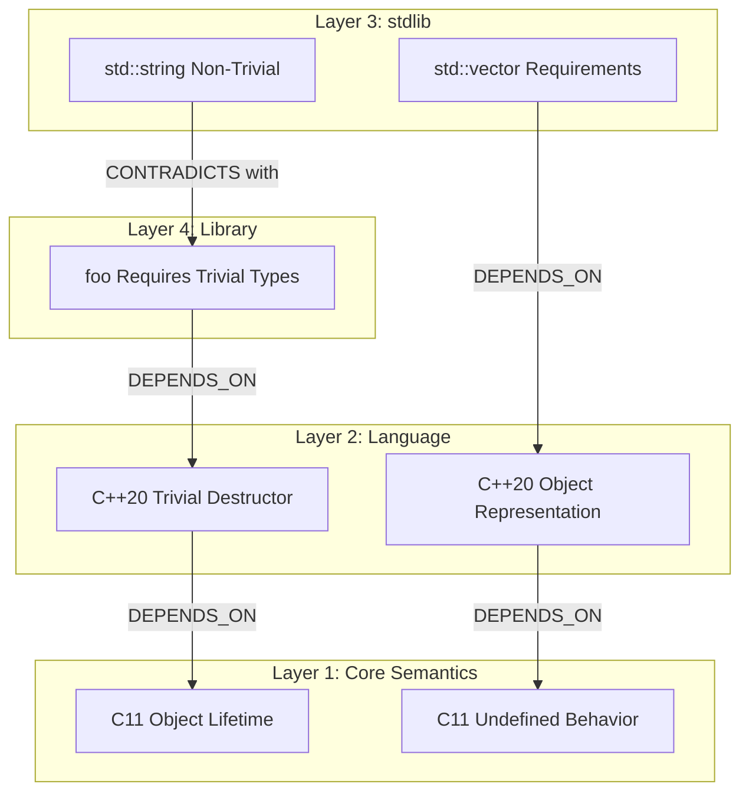
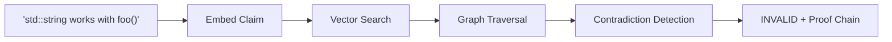
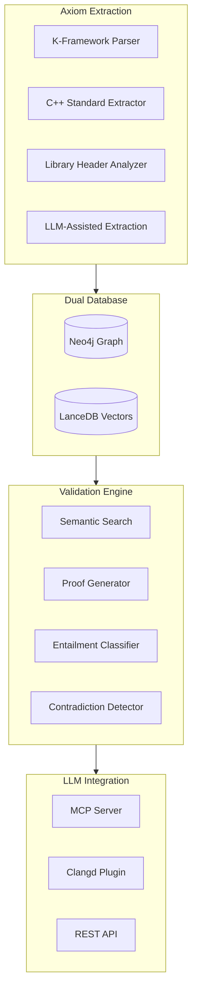
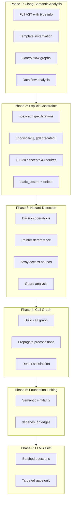
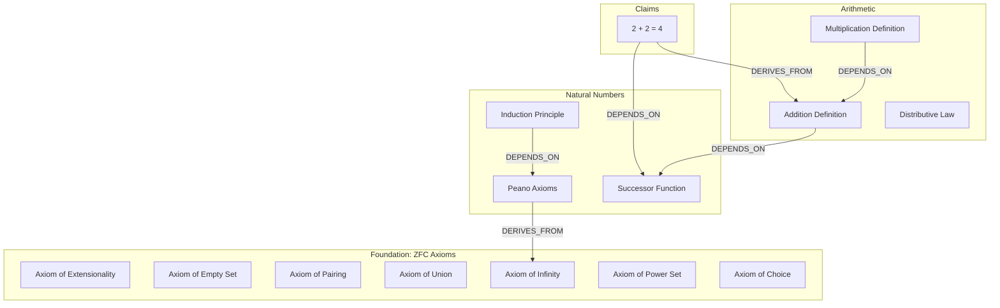
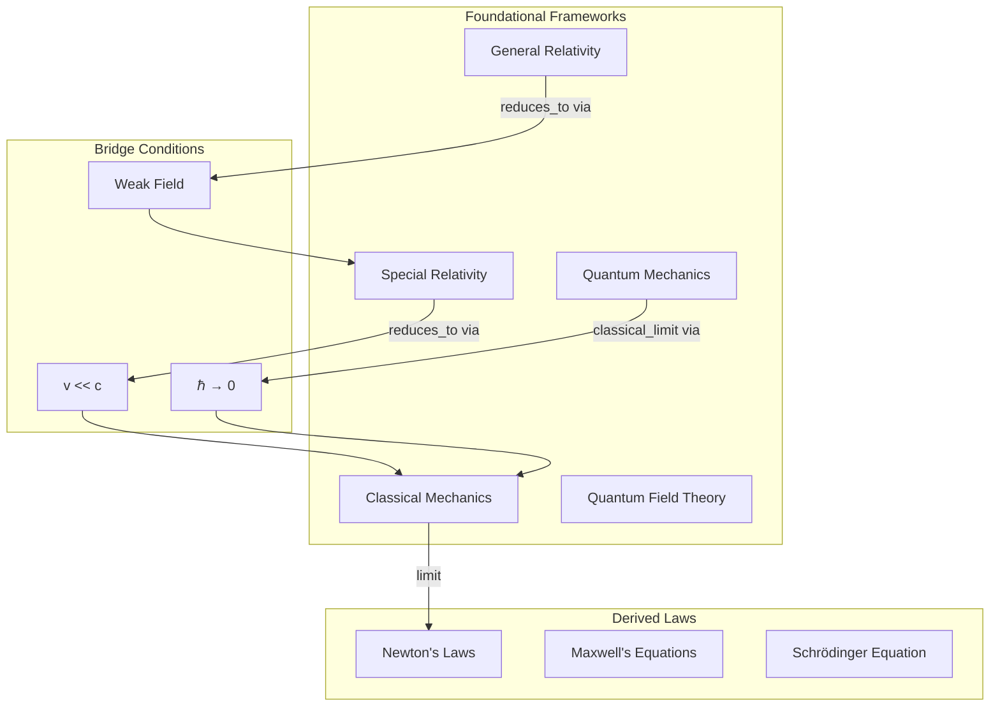
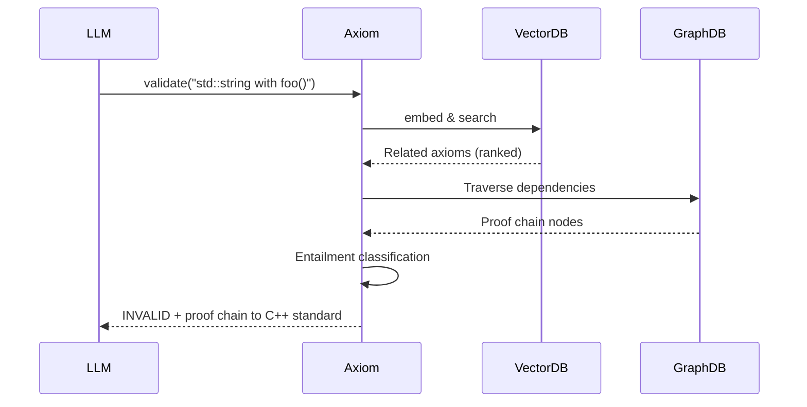

# Axiom: Grounded Truth Composition for Large Language Models

## A Framework for Eliminating Hallucination Through Atomic Semantic Units

**Version 1.0 - January 2026**

**Author:** Matt Varendorff
**Institution:** Independent Research
**Contact:** https://github.com/mattyv/axiom

---

## Abstract

Large Language Models (LLMs) have demonstrated remarkable capabilities in code generation, mathematical reasoning, and scientific discourse. However, their tendency to confidently produce plausible-sounding but incorrect information—colloquially termed "hallucination"—remains a fundamental limitation with potentially catastrophic consequences in safety-critical domains.

This paper introduces **Axiom**, a framework that addresses hallucination by constructing knowledge from atomic units of verified truth—called *axioms*—composed into directed acyclic graphs (DAGs) that enable semantic search and proof-chain validation. We demonstrate the framework's application to C/C++ code validation through integration with formal semantics (K-Framework) and language standards, then generalise the approach to mathematics, physics, and other domains where grounded truth matters.

The core insight is simple: an LLM cannot hallucinate about a fact if we can trace that fact back to a formally verified source through an unbroken chain of logical dependencies. Rather than asking "is this claim true?", Axiom asks "can we construct a proof that this claim follows from established axioms?"

---

## 1. Introduction: The Hallucination Problem

### 1.1 A Yarn About a Nasty Bug

Let me tell you a story, mate.

Picture this: you're a junior dev at a fintech startup in Melbourne. It's 2 AM, you're absolutely knackered, and your AI coding assistant just wrote what looks like perfectly reasonable code to handle currency conversions. The code compiles. The tests pass. You ship it.

Three days later, your company's lost $47,000 because the AI confidently used `int` arithmetic for dollar amounts, and when someone converted $2,147,483,648 worth of Indonesian Rupiah... well, signed integer overflow is undefined behaviour in C. The number wrapped around. Money vanished into the mathematical aether.

The LLM knew what `int` meant. It knew the syntax. It even knew overflow was "something to watch out for." But it didn't *truly* understand that signed overflow in C isn't just a warning—it's a cosmic permission slip for the compiler to do literally anything, including optimising your bounds check into oblivion.

This, in essence, is the hallucination problem: LLMs pattern-match on surface features without access to the deep semantic grounding that would prevent such errors.

### 1.2 Why Existing Solutions Fall Short

Current approaches to LLM reliability fall into several categories, each with fundamental limitations:

**Retrieval-Augmented Generation (RAG):** Fetches relevant documents to provide context. However, RAG provides *information* without *validation*. An LLM can retrieve a document explaining undefined behaviour and still generate code that invokes it—because retrieval doesn't guarantee comprehension or constraint satisfaction.

**Fine-tuning and RLHF:** Improves general behaviour but cannot guarantee specific semantic constraints. A model fine-tuned on "safe C code" might still produce unsafe code in novel situations outside its training distribution.

**Static Analysis Tools:** Excellent at catching known patterns but operate at the syntactic level. They can't validate semantic claims like "this library requires thread-safe types" unless specifically programmed for that pattern.

**Formal Verification:** Provides mathematical guarantees but requires enormous effort to specify and verify. Impractical for general-purpose code generation.

### 1.3 The Axiom Approach

Axiom takes a different path. Rather than trying to make LLMs "understand" constraints, we externalise that understanding into a queryable knowledge graph where:

1. **Axioms** are atomic units of verified truth, extracted from formal specifications
2. **Relationships** connect axioms through logical dependencies (DEPENDS_ON, DERIVES_FROM, CONTRADICTS)
3. **Semantic search** enables finding relevant axioms for any claim
4. **Proof chains** trace claims back to foundational truths

When an LLM claims "you can use `std::string` with `foo()`", Axiom doesn't ask the LLM if this is true. It searches for relevant axioms, traverses the dependency graph, and either:
- Constructs a proof chain validating the claim, or
- Identifies a contradiction with a specific axiom and formal reference

The LLM becomes a *consumer* of verified knowledge rather than a *source* of unverified claims.

---

## 2. Theoretical Foundations

### 2.1 What Is an Axiom?

In mathematical logic, an axiom is a statement accepted as true without proof—a foundational building block from which theorems are derived. Axiom (the framework) adopts this concept for software semantics:

**Definition 2.1 (Axiom):** An axiom is a triple `(content, formal_spec, source)` where:
- `content` is a human-readable description of the truth
- `formal_spec` is a machine-checkable specification (when available)
- `source` is a reference to the authoritative origin (standard, specification, formal proof)

**Example 2.1:** A C11 axiom for division by zero:

```toml
[[axioms]]
id = "c11_expr_div_by_zero_ub"
content = "Division by zero is undefined behavior in C"
formal_spec = "rule <k> I1 / 0 => undefined ... </k>"
source = "C11 Standard §6.5.5¶5"
layer = "c11_core"
confidence = 1.0
```

The key insight is that this axiom's truth doesn't depend on an LLM's "belief"—it's grounded in the ISO C11 standard and formalised in K-Framework semantics.

### 2.2 The Axiom Hierarchy

Axioms exist in layers of increasing specificity:

```
┌─────────────────────────────────────────────────────────────────┐
│                     Layer 4: Library Axioms                      │
│        Application-specific constraints (FitHub, OpenSSL)        │
├─────────────────────────────────────────────────────────────────┤
│                   Layer 3: Standard Library                      │
│         Container requirements, iterator guarantees              │
├─────────────────────────────────────────────────────────────────┤
│                   Layer 2: Language Features                     │
│          C++20 concepts, templates, memory model                 │
├─────────────────────────────────────────────────────────────────┤
│                  Layer 1: Core Semantics                         │
│         C11/C++ formal semantics from K-Framework                │
└─────────────────────────────────────────────────────────────────┘
```

**Figure 1:** The Axiom layer hierarchy

Each layer builds upon the previous, with explicit `depends_on` relationships forming the DAG structure. A library axiom stating "foo() requires trivially_destructible types" depends on the C++20 language axiom defining `trivially_destructible`, which in turn depends on core axioms about object lifetimes.

### 2.3 The Directed Acyclic Graph (DAG)

The axiom collection forms a DAG where:
- **Nodes** are axioms (foundational truths or derived knowledge)
- **Edges** represent logical relationships:
  - `DEPENDS_ON`: Axiom A requires Axiom B to hold
  - `DERIVES_FROM`: Axiom A can be logically inferred from Axiom B
  - `CONTRADICTS`: Axiom A is logically incompatible with Axiom B



**Figure 2:** Example DAG structure showing cross-layer dependencies

The DAG property (no cycles) is crucial: it ensures proof chains terminate and validation is decidable. When cycles are detected during ingestion, they're flagged for manual resolution.

### 2.4 Semantic Search and Embedding

Axioms are stored with vector embeddings enabling semantic similarity search. When validating a claim:

1. **Embed the claim** using the same embedding model (all-MiniLM-L6-v2)
2. **Search for related axioms** across all layers
3. **Traverse the graph** from found axioms to their dependencies
4. **Identify contradictions** through relationship analysis



**Figure 3:** The validation pipeline

The dual-database architecture (LanceDB for vectors, Neo4j for graph traversal) enables both semantic discovery and logical reasoning.

---

## 3. Architecture and Implementation

### 3.1 System Overview

Axiom consists of four major subsystems:



**Figure 4:** High-level system architecture

### 3.2 Axiom Extraction

The extraction pipeline transforms various sources into normalised axiom format:

**K-Framework Extraction (Automated):**

The K-Framework provides formal operational semantics for C11 and C++. Axiom parses `.k` files extracting rules as axioms:

```python
# From axiom/extractors/k_semantics.py
def extract_rule(rule: KRule) -> Axiom:
    return Axiom(
        id=generate_id(rule),
        content=generate_natural_language(rule),
        formal_spec=rule.k_cell,
        layer="c11_core",
        confidence=1.0,  # Formal specs get full confidence
        source_file=rule.source_file,
        source_line=rule.line_number
    )
```

**Standard Extraction (LLM-Assisted):**

For C++20 standard text, we use a hybrid approach:

1. Fetch specification sections from eel.is/c++draft
2. Convert to clean text
3. Use Claude to extract structured axioms with references
4. Human review for quality assurance

The extraction prompt instructs Claude to identify:
- Preconditions ("requires", "shall not", "must be")
- Postconditions ("returns", "effects")
- Undefined behaviour triggers
- Exception specifications
- Complexity guarantees

**Library Extraction (Interactive):**

Library authors extract axioms through an interactive session:

```bash
python scripts/ingest_library.py -r /path/to/fithub

# Interactive review:
# [1/42] WorkoutSession::start()
#   Extracted: "start() must not be called on an already-started session"
#   Confidence: 0.85
#   [A]pprove, [E]dit, [R]eject, [S]kip? A
```

Header annotations provide hints:

```cpp
// @axiom:precondition workout != nullptr
// @axiom:pairs_with end_session
// @axiom:thread_safety single_threaded
void start_session(Workout* workout);
```

### 3.3 The Knowledge Graph Schema

Neo4j stores axioms and relationships with the following schema:

```cypher
// Node types
(:Axiom {
    id: STRING,
    content: STRING,
    formal_spec: STRING,
    layer: STRING,
    confidence: FLOAT,
    function: STRING?,
    axiom_type: STRING
})

// Relationship types
(:Axiom)-[:DEPENDS_ON {reason: STRING, required: BOOL}]->(:Axiom)
(:Axiom)-[:CONTRADICTS {explanation: STRING}]->(:Axiom)
(:Axiom)-[:DERIVES_FROM {inference_rule: STRING}]->(:Axiom)
```

The current knowledge base contains:

| Layer | Axiom Count | Primary Source |
|-------|-------------|----------------|
| c11_core | ~890 | K-Framework C Semantics |
| cpp_core | ~825 | K-Framework C++ Semantics |
| cpp20_language | ~400 | ISO C++ Draft |
| cpp20_stdlib | ~300 | ISO C++ Draft |
| **Total** | **~3,500** | |

### 3.4 Validation Pipeline

When validating a claim, Axiom performs:

```python
def validate_claim(claim: str) -> ValidationResult:
    # 1. Semantic search for related axioms
    related = vector_db.search(embed(claim), top_k=20)

    # 2. Filter by layer and confidence
    foundation = [a for a in related
                  if a.layer in FOUNDATION_LAYERS]

    # 3. Generate proof chain
    proof_chain = proof_generator.generate(
        claim=claim,
        axioms=foundation
    )

    # 4. Classify entailment relationships
    for step in proof_chain.steps:
        step.relationship = entailment_classifier.classify(
            claim, step.axiom
        )

    # 5. Detect contradictions
    contradictions = [s for s in proof_chain.steps
                      if s.relationship == "CONTRADICTS"]

    return ValidationResult(
        claim=claim,
        is_valid=len(contradictions) == 0,
        contradictions=contradictions,
        proof_chain=proof_chain
    )
```

The entailment classifier uses polarity analysis: when a claim's sentiment ("is safe", "works with") conflicts with an axiom's polarity ("undefined behaviour", "must not"), a contradiction is flagged.

---

## 4. Case Study: The FitHub Library

### 4.1 Background

Let's make this concrete with a hypothetical example. FitHub is a C++ library for fitness tracking applications, providing APIs for:

- Workout session management
- Heart rate zone calculations
- Calorie expenditure estimation
- Exercise pattern recognition

An LLM assisting with FitHub integration faces challenges: the library has implicit constraints about threading, object lifetimes, and data validity that aren't obvious from API signatures alone.

### 4.2 Extracting FitHub Axioms

After running the extraction pipeline on FitHub, we obtain axioms like:

```toml
[[axioms]]
id = "fithub_workout_session_start_precondition"
content = "WorkoutSession::start() must not be called on an already-active session"
formal_spec = "requires(!is_active())"
layer = "library"
function = "WorkoutSession::start"
signature = "void WorkoutSession::start()"
header = "fithub/workout.h"
axiom_type = "precondition"
depends_on = ["cpp20_class_member_functions_this_validity"]

[[axioms]]
id = "fithub_heartrate_zone_range_constraint"
content = "Heart rate values must be between 30 and 250 BPM for zone calculations"
formal_spec = "30 <= heart_rate && heart_rate <= 250"
layer = "library"
function = "calculate_zone"
axiom_type = "precondition"
depends_on = ["c11_expr_relational_comparison_defined"]

[[axioms]]
id = "fithub_calorie_callback_thread_safety"
content = "Calorie update callbacks are invoked from a background thread"
formal_spec = "callback_thread != caller_thread"
layer = "library"
function = "set_calorie_callback"
axiom_type = "effect"
depends_on = ["cpp20_thread_safety_data_race_ub"]
```

### 4.3 Validation in Action

**Scenario 1: The Naive Integration**

A developer asks their AI assistant: "Write code to track a 30-minute run using FitHub."

The LLM generates:

```cpp
void track_run() {
    FitHub::WorkoutSession session;
    session.start();

    // ... later, user clicks "resume after pause"
    session.start();  // Uh oh

    session.end();
}
```

Without Axiom, this code compiles and might even appear to work. With Axiom:

```
VALIDATION RESULT: INVALID

Claim: "Calling start() after previous start() is valid"
Contradicts: fithub_workout_session_start_precondition

Proof chain:
1. session.start() at line 3 activates the session
2. session.start() at line 6 violates precondition
3. Axiom: "start() must not be called on an already-active session"
4. Grounded in: WorkoutSession state machine invariants

Suggested fix: Check is_active() before calling start(), or use resume()
```

**Scenario 2: The Threading Footgun**

```cpp
void update_ui_calories(FitHub::Session& session) {
    session.set_calorie_callback([this](double cal) {
        // Called from background thread!
        ui_label.setText(format_calories(cal));  // UI from wrong thread
    });
}
```

Axiom validation:

```
VALIDATION RESULT: WARNING

Claim: "Updating UI from calorie callback is safe"
Potential contradiction: fithub_calorie_callback_thread_safety

Proof chain:
1. set_calorie_callback() registers a callback
2. Axiom: "callbacks are invoked from a background thread"
3. UI updates from non-main thread may cause crashes or corruption
4. Depends on: cpp20_thread_safety_data_race_ub

Suggested fix: Post callback results to main thread queue
```

### 4.4 The Proof Chain Advantage

The critical difference from traditional linting: Axiom doesn't just say "this might be wrong." It provides a *proof chain* tracing the issue back to formal semantics:

```
FitHub callback threading issue
    ↓ depends_on
C++20 data race undefined behaviour
    ↓ depends_on
C11 memory model non-atomic access
    ↓ formalised_in
K-Framework concurrent semantics rules
```

This chain serves multiple purposes:

1. **Explanation**: The LLM (and human) understands *why* something is problematic
2. **Verification**: The reasoning can be audited and corrected
3. **Learning**: Patterns emerge from accumulated proof chains
4. **Confidence**: Claims backed by formal semantics carry more weight

---

## 5. The C++20 Extraction Engine

### 5.1 Design Philosophy: Exploit What C++ Gives Us

Here's where it gets properly interesting, mate. Modern C++ is increasingly *explicit* about constraints. C++20 gave us concepts, requires clauses, `[[nodiscard]]`, and a stack of other features that make constraints visible in the code itself.

The extraction engine exploits this. Instead of relying entirely on LLM interpretation (expensive, slow, sometimes wrong), we use Clang's semantic analysis to extract constraints at near-perfect confidence:

```
┌────────┬──────────────────────────────────────────────────────────┐
│  1.0   │ Clang: Compiler-enforced (noexcept, [[nodiscard]], etc) │
├────────┼──────────────────────────────────────────────────────────┤
│  0.95  │ Clang: Pattern + CFG (hazard with guard analysis)       │
├────────┼──────────────────────────────────────────────────────────┤
│  0.90  │ Clang: Propagated (inherited from callee preconditions) │
├────────┼──────────────────────────────────────────────────────────┤
│  0.85  │ Spec KB: Matched to foundation axiom (eel.is extract)   │
├────────┼──────────────────────────────────────────────────────────┤
│  0.70  │ LLM Fallback: Batched, targeted questions (~5% of code) │
└────────┴──────────────────────────────────────────────────────────┘
```

**Figure 8:** Confidence hierarchy for extraction sources

The philosophy is: try cheap and accurate first (Clang), fall back to LLM only for the 5% of cases that genuinely need interpretation.

### 5.2 Six-Phase Extraction Pipeline

The extraction engine runs in six phases:



**Figure 9:** The six-phase extraction pipeline

**Phase 1: Clang Semantic Analysis**

We use a native C++ tool built with LibTooling, not Python bindings. Why? Because libclang's Python bindings are incomplete—many AST nodes aren't exposed, C++20 features have limited support, and CFG/dataflow analysis requires direct Clang API access.

**Phase 2: Explicit Constraint Extraction**

Modern C++ tells us a lot:

```cpp
// These all become axioms automatically:
[[nodiscard]] Result process() noexcept;  // Must use return, won't throw
requires std::integral<T>                  // T must be integral type
void foo(T x);

static_assert(sizeof(T) >= 4);            // Size constraint

template<typename T>                       // Only for default-constructible
void bar() requires std::default_initializable<T>;
```

Each of these generates an axiom with confidence 1.0—the compiler enforces them.

**Phase 3: Hazard Detection**

Pattern matching identifies hazardous operations:
- Division → divisor must not be zero
- Pointer dereference → pointer must not be null
- Array access → index must be in bounds

But we're cleverer than that. Guard analysis checks if a hazard is already protected:

```cpp
void process(int* ptr, int divisor) {
    if (ptr == nullptr) return;   // Guard detected!
    if (divisor == 0) return;     // Guard detected!

    *ptr = 100 / divisor;         // Hazards are guarded - no precondition needed
}
```

**Phase 4: Call Graph & Propagation**

If function `A` calls function `B`, and `B` has a precondition, that precondition propagates to `A` unless `A` satisfies it before the call:

```cpp
void B(int* p) {
    // Axiom: p must not be null
    *p = 42;
}

void A(int* p) {
    B(p);  // Propagated: A requires p non-null (inherited from B)
}

void C(int* p) {
    if (p != nullptr) {
        B(p);  // NOT propagated: precondition satisfied by guard
    }
}
```

**Phase 5: Foundation Linking**

Extracted axioms are linked to foundation axioms via semantic similarity search:

```python
# Library axiom from extraction
library_axiom = "process() requires ptr != nullptr"

# Semantic search finds:
foundation_axiom = "c11_null_pointer_dereference_ub"
# Content: "Dereferencing a null pointer is undefined behavior"

# Creates: depends_on relationship
```

**Phase 6: LLM Assist (Minimal)**

Only ~5% of cases need LLM interpretation—typically complex invariants that can't be detected through patterns:

```cpp
// This needs LLM: the relationship between cache_ and compute() isn't obvious
class LazyValue {
    mutable std::optional<T> cache_;
    T compute() const;
public:
    T get() const {
        if (!cache_) cache_ = compute();  // What's the invariant here?
        return *cache_;
    }
};
```

LLM calls are batched (10+ functions per call) and ask targeted questions, not open-ended interpretation.

### 5.3 Real-World Case Study: GoogleTest

Let's look at a real extraction. Running the engine on GoogleTest produces 7,000+ axioms:

```toml
[[axioms]]
id = "testing::MatchResultListener.abstract"
content = "MatchResultListener is abstract and cannot be instantiated directly"
formal_spec = "is_abstract(MatchResultListener)"
layer = "user_library"
confidence = 1.0
source_file = "gtest-matchers.h"
axiom_type = "constraint"
on_violation = "Compilation error when attempting direct instantiation"
depends_on = ["cpp20_over_match_general_illfomed_no_best_viable"]

[[axioms]]
id = "testing::MatchResultListener.virtual_dtor"
content = "MatchResultListener has virtual destructor (safe for polymorphic use)"
formal_spec = "has_virtual_destructor(MatchResultListener)"
layer = "user_library"
confidence = 1.0
axiom_type = "constraint"
on_violation = "Undefined behavior if destroyed through base pointer"
depends_on = ["cpp20_has_virtual_destructor_precond_complete"]

[[axioms]]
id = "testing::MatchResultListener::operator<<.complexity.template_instantiation"
content = "operator<< is a template; each unique argument combo causes separate instantiation"
formal_spec = "instantiation_count = O(unique_template_args^1)"
layer = "user_library"
confidence = 0.95
axiom_type = "complexity"
on_violation = "Increased binary size and compilation time"
```

**The Power of Automatic Extraction:**

Without manual annotation, the engine discovered:
- Abstract class constraints (can't instantiate directly)
- Virtual destructor presence (safe polymorphism)
- Template instantiation complexity
- Macro semantics (EXPECT_DEATH, ASSERT_TRUE, etc.)
- Function pairing relationships (SetUp/TearDown)

An LLM using GoogleTest now has access to 7,000+ grounded facts about its API.

### 5.4 Two Complementary Axiom Sources

The extraction engine complements spec-based extraction:

```
┌─────────────────────────────────────┐
│   C++ Standard Spec (eel.is)        │  ← Spec-based (LLM extraction)
│   "What the standard guarantees"    │
│   - Formal semantics                │
│   - UB definitions                  │
│   - Algorithm complexity            │
│   - Confidence: 0.85                │
└─────────────────────────────────────┘
                    +
┌─────────────────────────────────────┐
│   Actual C++ Code (Clang analysis)  │  ← Code-based (this engine)
│   "What the code actually does"     │
│   - Compiler-enforced constraints   │
│   - Hazardous operations            │
│   - Call graph preconditions        │
│   - Confidence: 0.95-1.0            │
└─────────────────────────────────────┘
                    =
┌─────────────────────────────────────┐
│   Combined Knowledge Base           │
│   - Spec axioms validate code       │
│   - Code axioms ground spec claims  │
│   - Cross-validation possible       │
└─────────────────────────────────────┘
```

**Figure 10:** Complementary axiom sources

The spec tells us what *should* happen. The code tells us what *does* happen. Together, they provide comprehensive grounding.

---

## 6. Generalisation to Mathematics

### 6.1 The Mathematical Axiom System

The axiom-DAG-search pattern applies naturally to mathematical reasoning. Consider a system grounded in ZFC set theory:



**Figure 5:** Mathematical axiom hierarchy

### 6.2 Validating Mathematical Claims

**Scenario: The Student's Error**

An LLM tutoring a student encounters: "Prove that √2 is rational."

The student claims: "Let √2 = p/q where p, q are coprime integers."

Traditional approach: The LLM might hallucinate a flawed proof or correctly identify the impossibility.

Axiom approach:

```
CLAIM: "√2 can be expressed as p/q with coprime integers"

VALIDATION: CONTRADICTION DETECTED

Proof chain:
1. Assume √2 = p/q (hypothesis for proof by contradiction)
2. Then 2 = p²/q², so 2q² = p²
3. Therefore p² is even, so p is even (axiom: even_square_implies_even)
4. Let p = 2k, then 4k² = 2q², so q² = 2k²
5. Therefore q is even
6. Both p and q even contradicts coprimality assumption
7. Grounded in: Fundamental theorem of arithmetic, Peano axioms

RESULT: The claim leads to contradiction. √2 is irrational.
```

The system doesn't just "know" √2 is irrational—it constructs a proof chain demonstrating why.

### 6.3 Mathematical Axiom Extraction

Mathematical axiom extraction differs from programming languages:

**From Formal Proof Systems:**
- Lean 4 mathlib contains thousands of proven theorems
- Each theorem becomes an axiom with its proof as `formal_spec`
- Dependencies map to Lean's dependency graph

**From Textbooks and Papers:**
- LLM-assisted extraction of definitions and theorems
- Cross-reference with formal proofs where available
- Lower confidence for informal sources

**Example Mathematical Axiom:**

```toml
[[axioms]]
id = "math_real_completeness"
content = "Every non-empty bounded above subset of real numbers has a least upper bound"
formal_spec = "∀S ⊆ ℝ, S ≠ ∅ ∧ (∃M, ∀x ∈ S, x ≤ M) → ∃sup(S)"
layer = "real_analysis"
confidence = 1.0
source = "Dedekind completeness axiom"
depends_on = ["zfc_axiom_of_union", "real_number_construction"]

[[axioms]]
id = "math_intermediate_value_theorem"
content = "A continuous function on [a,b] attains all values between f(a) and f(b)"
formal_spec = "continuous(f, [a,b]) ∧ f(a) < y < f(b) → ∃c ∈ (a,b), f(c) = y"
layer = "real_analysis"
confidence = 1.0
source = "Bolzano's theorem proof"
depends_on = ["math_real_completeness", "math_continuous_function_def"]
```

### 6.4 Preventing Mathematical Hallucination

LLMs commonly make mathematical errors like:

1. **Invalid limit manipulations** (swapping limits and integrals incorrectly)
2. **Incorrect convergence claims** (assuming pointwise implies uniform)
3. **Unstated assumptions** (using AC without noting it)

With Axiom:

```
CLAIM: "lim(∫fₙ) = ∫(lim fₙ) for this sequence"

VALIDATION: INSUFFICIENT

This claim requires:
1. Convergence mode of fₙ → f (pointwise/uniform/L¹)
2. Dominating function (for Lebesgue DCT)
3. Measure space specification

Related axioms found:
- Dominated Convergence Theorem (with requirements)
- Monotone Convergence Theorem
- Fatou's Lemma

The claim cannot be validated without specifying convergence type.
Proof chain incomplete at: convergence_mode_specification
```

---

## 7. Generalisation to Physics

### 7.1 Physical Axiom Structure

Physics presents unique challenges: axioms often carry implicit domains of applicability (classical limits, relativistic regimes, quantum scales).



**Figure 6:** Physical theory relationships and limit conditions

### 7.2 Physics Axiom Examples

```toml
[[axioms]]
id = "phys_newton_second_law"
content = "Force equals mass times acceleration in an inertial reference frame"
formal_spec = "F = m·a"
layer = "classical_mechanics"
confidence = 1.0
domain_constraints = ["v << c", "quantum_effects_negligible"]
depends_on = ["phys_inertial_frame_def", "phys_mass_conservation"]

[[axioms]]
id = "phys_energy_momentum_relativistic"
content = "E² = (pc)² + (mc²)² relates energy and momentum relativistically"
formal_spec = "E² = p²c² + m₀²c⁴"
layer = "special_relativity"
confidence = 1.0
supersedes = ["phys_newton_kinetic_energy"]  # New relationship type
depends_on = ["phys_lorentz_invariance", "phys_spacetime_interval"]

[[axioms]]
id = "phys_heisenberg_uncertainty"
content = "Position and momentum cannot be simultaneously measured with arbitrary precision"
formal_spec = "Δx·Δp ≥ ℏ/2"
layer = "quantum_mechanics"
confidence = 1.0
depends_on = ["qm_canonical_commutation", "qm_observable_def"]
```

### 7.3 The Domain Applicability Problem

A critical extension for physics: axioms carry **domain constraints** specifying when they're valid.

```python
class PhysicsAxiom(Axiom):
    domain_constraints: List[str]  # ["v << c", "T > 0"]
    supersedes: List[str]          # What it replaces in its domain
    regime: str                    # "classical", "relativistic", "quantum"
```

When validating a physics claim:

```
CLAIM: "Using F=ma to calculate electron motion in an atom"

VALIDATION: DOMAIN MISMATCH

phys_newton_second_law applies when:
  - v << c ✓ (electron velocities typically << c)
  - quantum_effects_negligible ✗ (atomic scale)

At atomic scales, must use:
  - phys_schrodinger_equation (quantum regime)
  - or phys_dirac_equation (relativistic quantum)

Proof chain shows:
  Newton's laws → classical limit of QM
  But this is the quantum regime, not classical limit
```

### 7.4 Dimensional Analysis as Axiom

Physics offers a powerful cross-check: dimensional analysis.

```toml
[[axioms]]
id = "phys_dimensional_consistency"
content = "Physical equations must be dimensionally consistent"
formal_spec = "dim(LHS) = dim(RHS) for any valid equation"
layer = "meta_physics"
confidence = 1.0
# This axiom is used for validation, not derivation

[[axioms]]
id = "phys_dimension_rules"
content = "Dimensional analysis rules"
formal_spec = """
[velocity] = [length]/[time]
[acceleration] = [velocity]/[time]
[force] = [mass]·[acceleration]
[energy] = [force]·[length]
"""
layer = "meta_physics"
```

This enables automatic validation:

```
CLAIM: "E = mv² is the kinetic energy formula"

VALIDATION: DIMENSIONALLY INCORRECT

Checking dimensions:
  LHS: [E] = [energy] = ML²T⁻²
  RHS: [m][v²] = M · (LT⁻¹)² = ML²T⁻²

Wait, dimensions match! But checking against formal axioms:

  phys_kinetic_energy_classical: KE = ½mv²

Contradiction: Missing factor of ½
The claim E = mv² is dimensionally valid but formally incorrect.
```

---

## 8. The Hallucination Mitigation Mechanism

### 8.1 Why This Works

LLM hallucination stems from several sources. Axiom addresses each:

| Hallucination Source | How Axiom Mitigates |
|---------------------|---------------------|
| **Training data gaps** | Axioms extracted from authoritative sources fill gaps |
| **Distributional drift** | Proof chains anchor claims to formal specs |
| **Confident uncertainty** | Validation returns explicit confidence and proof completeness |
| **Context window limits** | Relevant axioms surfaced via semantic search |
| **Subtle constraint violations** | Contradiction detection catches logical incompatibilities |

### 8.2 The Grounding Chain

Consider how claims flow through the system:



**Figure 7:** Claim validation sequence

### 8.3 Confidence Propagation

Axioms carry confidence scores (0.0-1.0) that propagate through the graph:

- **Formal specifications**: 1.0 (K-Framework, ISO standards)
- **Official documentation**: 0.9-0.95
- **LLM-extracted with review**: 0.7-0.9
- **LLM-extracted unreviewed**: 0.5-0.7

Proof chain confidence = minimum confidence along the chain:

```python
def proof_chain_confidence(chain: List[Axiom]) -> float:
    return min(axiom.confidence for axiom in chain)
```

This ensures that weak links are surfaced:

```
Proof chain confidence: 0.72
Weakest link: mylib_threading_assumption (LLM-extracted, unreviewed)
Consider manual review of this axiom before relying on validation.
```

---

## 9. Integration and Tooling

### 9.1 MCP Server Integration

Axiom integrates with Claude Code via Model Context Protocol (MCP):

```json
{
  "mcpServers": {
    "axiom": {
      "command": "python",
      "args": ["-m", "axiom.mcp.server"]
    }
  }
}
```

Available tools:

| Tool | Purpose |
|------|---------|
| `validate_claim` | Check if a claim contradicts known axioms |
| `search_axioms` | Find axioms semantically related to a query |
| `get_axiom` | Retrieve specific axiom with full details |
| `get_stats` | Knowledge base statistics |

### 9.2 Clangd Plugin (Planned)

For real-time feedback during coding:

```
memory.c:87:5: error: [axiom:heap-use-after-free] use after free
    buffer->data[0] = 'x';
    ^~~~~~~~~~~~~~~~~~~

  Violation: Pointer 'buffer' was freed at line 82
  Formal: C11 §7.22.3.3 - accessing freed memory is undefined behavior

  Proof chain:
    1. free(buffer) called at memory.c:82
    2. No reassignment of 'buffer' between free and use
    3. This access is undefined behavior
```

Diagnostic levels:
- **ERROR**: Definite violation (must fix)
- **WARNING**: Likely issue (should investigate)
- **INFO**: Semantic context (good to know)
- **HINT**: Exploration prompt (can query via MCP for details)

### 9.3 REST API

For programmatic access:

```bash
curl -X POST http://localhost:8000/validate \
  -H "Content-Type: application/json" \
  -d '{"claim": "std::string works with foo()"}'
```

Response:
```json
{
  "valid": false,
  "contradictions": [{
    "axiom_id": "mylib_foo_trivial_type",
    "content": "foo() requires trivially destructible types",
    "formal_ref": "trivially_destructible<T>"
  }],
  "proof_chain": [
    {"step": 1, "axiom": "mylib_foo_trivial_type", "layer": "library"},
    {"step": 2, "axiom": "cpp20_trivially_destructible", "layer": "cpp20_language"},
    {"step": 3, "axiom": "cpp20_string_nontrivial_dtor", "layer": "cpp20_stdlib"}
  ],
  "confidence": 0.95
}
```

---

## 10. Limitations and Future Work

### 10.1 Current Limitations

**Extraction Completeness:**
Not all constraints are extractable. Some are implicit in code patterns, runtime behaviour, or documentation that's ambiguous.

**False Positives:**
Semantic similarity search can surface axioms that seem related but aren't actually applicable. The entailment classifier mitigates this but isn't perfect.

**Domain-Specific Knowledge:**
Extending to new domains (mathematics, physics) requires bootstrapping foundational axioms—a significant effort.

**Dynamic Behaviour:**
Axiom reasons about static properties. Runtime behaviour, timing, and external state are harder to capture.

### 10.2 Future Directions

**Automatic Axiom Discovery:**
Use LLMs to propose axioms from code behaviour, then validate through testing or formal verification.

**Temporal Axioms:**
Extend to capture ordering constraints, lifecycle patterns, and protocol states.

**Cross-Language Generalisation:**
Adapt the framework for Rust (borrow checker semantics), Python (dynamic typing), and others.

**Proof Synthesis:**
When a claim isn't directly validated, attempt to synthesise a proof from available axioms.

**Community Axiom Repositories:**
Like package managers for dependencies, enable axiom sharing for common libraries.

---

## 11. Related Work

### 11.1 Formal Methods

**K-Framework (Rosu et al.):** Provides the formal semantic foundation for C11 and C++ axioms. Axiom extends this by making semantics queryable.

**Coq and Lean:** Formal proof assistants that verify mathematical claims. Axiom could integrate their theorem databases.

**CBMC and other model checkers:** Verify specific properties but don't provide queryable knowledge graphs.

### 11.2 RAG and Knowledge Graphs

**GraphRAG (Microsoft):** Uses knowledge graphs for retrieval. Axiom specialises this for formal verification chains.

**LangChain and LlamaIndex:** General RAG frameworks. Axiom adds the validation layer.

### 11.3 Code Analysis

**Clang Static Analyzer:** Pattern-based bug detection. Axiom provides semantic grounding beyond patterns.

**Infer (Facebook):** Separation logic analysis. Could be integrated as an axiom source.

---

## 12. Conclusion

### 12.1 Summary

Axiom addresses LLM hallucination through a fundamentally different approach: rather than trying to make models "understand" constraints, we externalise understanding into a queryable knowledge graph grounded in formal specifications.

The key contributions are:

1. **Axiom model**: Atomic units of verified truth with formal specifications
2. **DAG composition**: Logical relationships enabling proof chains
3. **Semantic search**: Finding relevant axioms for any claim
4. **Validation pipeline**: Contradiction detection with explainable results
5. **Generalisation**: The pattern applies to code, mathematics, physics, and beyond

### 12.2 The Bigger Picture

Look, here's the thing. LLMs are bloody brilliant at pattern matching and generating plausible-sounding stuff. But "plausible" and "correct" aren't the same thing, especially when you're writing code that handles money, or medical data, or anything where being wrong actually matters.

Axiom doesn't make LLMs smarter. It makes them *accountable*. Every claim can be traced. Every contradiction is explained. Every validation comes with a proof chain back to formal sources.

It's like having a really pedantic mate who's memorised the C++ standard looking over your shoulder. Annoying sometimes, yeah. But better than shipping a use-after-free to production.

### 12.3 Call to Arms

This framework is open source and actively developed. We're looking for:

- **Library maintainers** to extract and ship axioms with their libraries
- **Formal methods researchers** to improve axiom extraction and validation
- **Domain experts** in mathematics and physics to bootstrap axiom sets
- **Tool developers** to build integrations beyond what we've done

The codebase is at https://github.com/mattyv/axiom. Chuck a PR, file an issue, or just have a yarn with us about where this could go.

---

## References

1. Roşu, G., & Şerbănuţă, T. F. (2010). An overview of the K semantic framework. *Journal of Logic and Algebraic Programming*, 79(6), 397-434.

2. ISO/IEC 9899:2011. *Programming languages — C*. International Organization for Standardization.

3. ISO/IEC 14882:2020. *Programming languages — C++*. International Organization for Standardization.

4. Lewis, P., et al. (2020). Retrieval-augmented generation for knowledge-intensive NLP tasks. *Advances in Neural Information Processing Systems*.

5. Brown, T., et al. (2020). Language models are few-shot learners. *Advances in Neural Information Processing Systems*.

6. OpenAI. (2023). GPT-4 technical report. *arXiv preprint arXiv:2303.08774*.

7. Anthropic. (2024). Claude Model Card. https://www.anthropic.com/model-card

8. Mathlib Community. (2020-). Mathlib: A unified library of mathematics formalized in Lean. https://leanprover-community.github.io/

9. Coq Development Team. (1999-). The Coq proof assistant reference manual. INRIA.

10. Calcagno, C., et al. (2015). Moving fast with software verification. *NASA Formal Methods Symposium*.

---

## Appendices

### Appendix A: Axiom TOML Schema

```toml
version = "1.0"
source = "library_name"

[[axioms]]
id = "unique_identifier"            # Required: globally unique
content = "Human readable truth"    # Required: natural language
formal_spec = "machine_checkable"   # Optional: formal specification
layer = "layer_name"                # Required: c11_core, library, etc.
confidence = 0.95                   # Required: 0.0-1.0
function = "function_name"          # Optional: related function
signature = "void foo(int x)"       # Optional: function signature
header = "lib/foo.h"                # Optional: source header
axiom_type = "precondition"         # Required: precondition, postcondition, etc.
depends_on = ["other_axiom_id"]     # Optional: dependency list
tags = ["memory", "safety"]         # Optional: searchable tags
```

### Appendix B: Layer Definitions

| Layer | Source | Confidence Range | Description |
|-------|--------|------------------|-------------|
| c11_core | K-Framework | 1.0 | C11 formal semantics |
| cpp_core | K-Framework | 1.0 | C++ formal semantics |
| cpp20_language | ISO C++20 | 0.95-1.0 | Language features |
| cpp20_stdlib | ISO C++20 | 0.90-0.95 | Standard library |
| library | Extraction | 0.70-0.95 | User library axioms |

### Appendix C: Relationship Types

| Type | Direction | Meaning | Example |
|------|-----------|---------|---------|
| DEPENDS_ON | A → B | A requires B to hold | foo_precond → trivially_destructible |
| DERIVES_FROM | A → B | A logically follows from B | theorem → axiom |
| CONTRADICTS | A ↔ B | A and B cannot both be true | string_nontrivial ↔ foo_requires_trivial |
| SUPERSEDES | A → B | A replaces B in certain domain | relativistic → classical |

---

*Document version 1.0. Last updated January 2026.*
