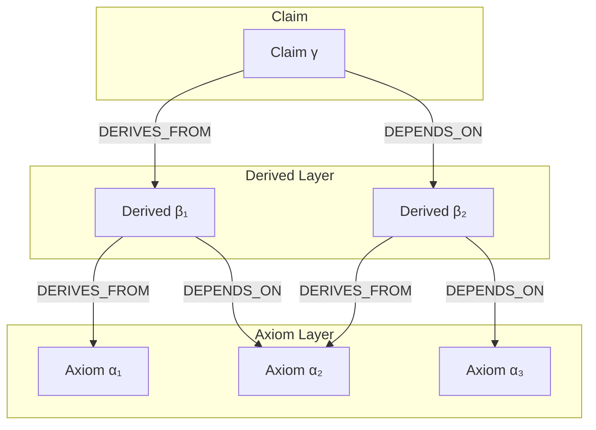
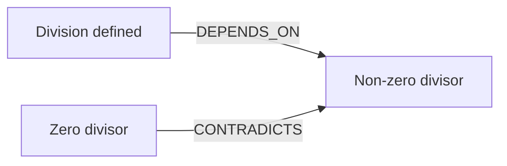
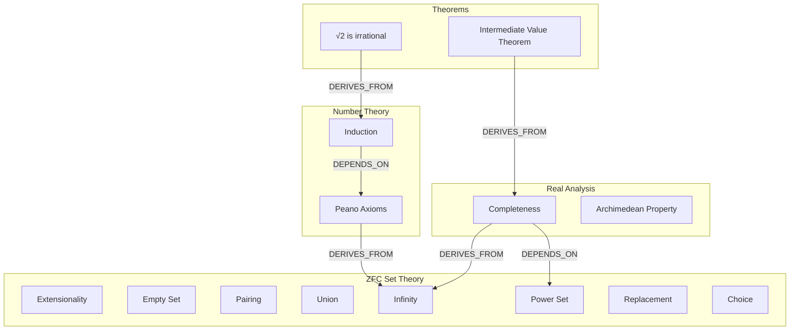
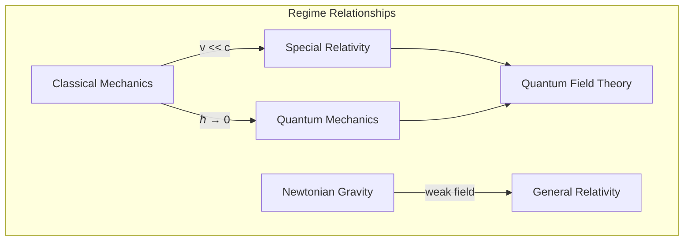
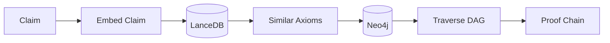

# Axiom: Compositional Truth for Grounded Reasoning

## A Framework for Constructing Complex Knowledge from Atomic Truths

**Version 2.0 - January 2026**

**Author:** Matt Varendorff
**Institution:** Independent Research
**Contact:** https://github.com/mattyv/axiom

---

## Abstract

This paper presents a framework for constructing and validating complex knowledge claims by composing atomic units of verified truth—*axioms*—into directed acyclic graphs (DAGs). The fundamental insight is ancient: since Euclid, mathematicians have known that complex theorems can be derived from simple axioms through chains of logical inference. We formalise this compositional structure for computational use, enabling semantic search over truth-spaces and proof-chain validation of arbitrary claims.

The framework addresses a critical problem in Large Language Model (LLM) deployment: hallucination. By grounding LLM outputs in verifiable axiom compositions, we transform the question "is this claim true?" into "can we construct a derivation of this claim from established axioms?"

We demonstrate the generic applicability of this axiom-DAG-search pattern across multiple domains: formal programming language semantics, mathematical theorem proving, and physical law verification. The pattern is domain-agnostic; only the axiom corpus and composition rules vary.

---

## 1. Introduction: The Compositional Nature of Truth

### 1.1 A Tale of Two Approaches

Let me tell you about two ways of knowing things, mate.

The first way is pattern matching. You see enough examples of swans, and you conclude "swans are white." This works brilliantly—until you sail to Australia and discover black swans. The knowledge was inductively derived from observations, and it was wrong.

The second way is axiomatic derivation. You start with truths you're absolutely certain about (axioms), and you derive new truths through logical rules. Euclid started with five postulates about points and lines, and derived all of plane geometry. The knowledge isn't guessed from examples—it's *constructed* from foundations.

Large Language Models are, fundamentally, pattern matchers of extraordinary sophistication. They've "seen" billions of examples and can generate remarkably plausible text. But plausible isn't the same as correct. When an LLM confidently states that a certain C++ operation is safe, or that a mathematical proof follows, or that a physical law applies—it's pattern matching, not deriving.

This paper describes a system for the second way of knowing: compositional truth construction.

### 1.2 The Core Insight

The central observation is this:

> **Complex knowledge can be decomposed into atomic truths (axioms) connected by logical dependencies, forming a directed acyclic graph. Any claim can be validated by constructing a path through this graph from established axioms to the claim.**

This is not a new idea. It's the foundation of mathematics since Euclid, formalised in the 19th century by Frege, Peano, and Russell, and computationally realised in the 20th century through proof assistants like Coq and Lean. What *is* new is applying this pattern to ground LLM outputs across arbitrary domains.

### 1.3 The Axiom-DAG-Search Pattern

The framework consists of three components:

1. **Axioms**: Atomic units of verified truth, each with a formal specification and confidence score
2. **DAG Structure**: Directed edges representing logical relationships (DEPENDS_ON, DERIVES_FROM, CONTRADICTS)
3. **Semantic Search**: Vector embeddings enabling discovery of relevant axioms for any claim



**Figure 1:** Compositional structure of derived knowledge

The DAG property (no cycles) is crucial: it ensures that derivation chains terminate and that every claim has a finite proof path back to foundational axioms.

---

## 2. Theoretical Foundations

### 2.1 Historical Context: The Axiomatic Method

The axiomatic method has a rich history spanning millennia:

**Euclid (c. 300 BCE)**: The *Elements* demonstrated that complex geometric theorems could be derived from five simple postulates. This established the paradigm of axiomatic mathematics.

**Gottlob Frege (1879)**: In *Begriffsschrift*, Frege developed the first rigorous formal logic and attempted to derive arithmetic from logical axioms alone. Though his system contained a paradox (discovered by Russell), it established that axiomatisation could be formalised with mathematical precision [1].

**Giuseppe Peano (1889)**: The Peano axioms reduced all of arithmetic to five foundational principles, demonstrating that even our intuitive understanding of numbers could be grounded in explicit axioms [2].

**Bertrand Russell & Alfred North Whitehead (1910-1913)**: *Principia Mathematica* attempted to derive all of mathematics from logical foundations, introducing type theory to avoid paradoxes [3].

**Haskell Curry & William Alvin Howard (1934-1969)**: The Curry-Howard correspondence revealed a deep isomorphism: *proofs are programs, propositions are types* [4]. This meant that proof composition follows the same laws as program composition—both form well-typed terms in a lambda calculus.

The key insight threading through this history: **derived knowledge inherits its validity from the axioms it depends on.** A theorem is true precisely because it can be traced back through a chain of valid inferences to accepted axioms.

### 2.2 Formal Definition of Axiom Composition

**Definition 2.1 (Axiom):** An axiom is a tuple `(id, content, formal_spec, confidence, source)` where:
- `id` is a unique identifier
- `content` is a natural language description
- `formal_spec` is a machine-checkable specification (when available)
- `confidence ∈ [0,1]` indicates certainty (1.0 for formal proofs)
- `source` references the authoritative origin

**Definition 2.2 (Axiom Composition):** Given axioms α₁, α₂, ..., αₙ and a derivation rule R, a new proposition β is a *valid composition* if:
- R(α₁, α₂, ..., αₙ) → β
- The derivation preserves truth (soundness)
- β inherits confidence: conf(β) ≤ min(conf(α₁), ..., conf(αₙ))

**Definition 2.3 (Axiom DAG):** An axiom DAG is a directed acyclic graph G = (V, E) where:
- V is the set of axioms and derived propositions
- E ⊆ V × V × {DEPENDS_ON, DERIVES_FROM, CONTRADICTS}
- The graph is acyclic: ∄ path v → v for any v ∈ V

**Theorem 2.1 (Proof Chain Existence):** For any claim γ in a consistent axiom DAG, either:
1. There exists a path from foundational axioms to γ (γ is validated), or
2. There exists an axiom α such that (γ, α) ∈ E with type CONTRADICTS (γ is refuted), or
3. No path exists (γ is undetermined with respect to the axiom corpus)

### 2.3 The Role of Semantic Search

Traditional theorem provers require exact queries. But when validating arbitrary natural language claims, we need *semantic* discovery of relevant axioms. This is achieved through vector embeddings:

```
claim: "division by zero causes undefined behaviour"
                    ↓ embed
            vector v ∈ ℝ³⁸⁴
                    ↓ similarity search
    [c11_div_zero_ub, c11_arithmetic_except, ...]
                    ↓ graph traversal
            proof chain to C11 standard
```

The embedding model maps both claims and axiom contents to a shared vector space where semantic similarity corresponds to geometric proximity. This enables discovering axioms that are *about* the same concepts as the claim, even when phrased differently.

### 2.4 Compositionality and the Curry-Howard Correspondence

The Curry-Howard correspondence [4] tells us that:

| Logic | Programming | Category Theory |
|-------|-------------|-----------------|
| Propositions | Types | Objects |
| Proofs | Programs | Morphisms |
| Implication A → B | Function A → B | Arrow A → B |
| Conjunction A ∧ B | Product (A, B) | Product A × B |
| Proof composition | Function composition | Morphism composition |

This correspondence is not merely analogical—it's a formal isomorphism. A proof that "from A and B we can derive C" corresponds exactly to a function `(A, B) → C`. Composing proofs corresponds to composing functions.

For our framework, this means:
- **Axiom composition is type-safe**: Invalid derivations fail to "type check"
- **Proof chains are programs**: They can be executed, optimised, and verified
- **The DAG is a category**: Objects are propositions, morphisms are proof paths

This categorical perspective explains why the framework is domain-agnostic: the compositional structure is universal, independent of whether the axioms concern programming languages, mathematics, or physics.

---

## 3. The Generic Axiom-DAG-Search Pattern

### 3.1 Pattern Overview

The pattern consists of four phases:

```mermaid
flowchart LR
    subgraph Phase1["1. Axiom Extraction"]
        E1[Identify atomic truths]
        E2[Formalise specifications]
        E3[Assign confidence]
    end

    subgraph Phase2["2. DAG Construction"]
        D1[Establish dependencies]
        D2[Detect contradictions]
        D3[Verify acyclicity]
    end

    subgraph Phase3["3. Semantic Indexing"]
        S1[Embed axiom content]
        S2[Build vector index]
        S3[Enable similarity search]
    end

    subgraph Phase4["4. Claim Validation"]
        V1[Embed claim]
        V2[Find related axioms]
        V3[Traverse proof paths]
        V4[Check contradictions]
    end

    Phase1 --> Phase2 --> Phase3 --> Phase4
```



**Figure 2:** The four-phase axiom-DAG-search pattern

### 3.2 Phase 1: Axiom Extraction

Axioms must be extracted from authoritative sources appropriate to the domain:

| Domain | Authoritative Sources | Extraction Method |
|--------|----------------------|-------------------|
| Programming Languages | ISO standards, K-Framework semantics | Automated parsing, LLM-assisted |
| Mathematics | Lean mathlib, Coq libraries, textbooks | Proof export, structured extraction |
| Physics | Peer-reviewed literature, established laws | Expert curation, dimensional validation |

The critical property: extracted axioms must be *atomic*—they should not be further decomposable into simpler truths within the domain. Composite claims belong in the derived layer.

### 3.3 Phase 2: DAG Construction

Edges in the DAG represent logical relationships:

**DEPENDS_ON (α → β):** β requires α to hold. If α is falsified, β loses its justification.

**DERIVES_FROM (α → β):** β can be logically inferred from α through a valid derivation rule.

**CONTRADICTS (α ↔ β):** α and β are mutually exclusive; both cannot be true simultaneously.



**Figure 3:** Relationship types in the axiom DAG

The DAG property must be maintained: cycles indicate circular reasoning and must be resolved. In practice, cycles often indicate axiom granularity problems—an axiom that should be split.

### 3.4 Phase 3: Semantic Indexing

Vector embeddings enable semantic search. The embedding model should be:
- **Domain-appropriate**: Technical language should cluster correctly
- **Efficient**: Sub-second search over millions of axioms
- **Stable**: Similar concepts should have similar embeddings across sessions

Current implementation uses `all-MiniLM-L6-v2` (384-dimensional embeddings) with LanceDB for vector storage and Neo4j for graph traversal.

### 3.5 Phase 4: Claim Validation

Given a claim γ, validation proceeds:

1. **Embed** γ to get vector v_γ
2. **Search** for axioms with vectors similar to v_γ
3. **Traverse** the DAG from found axioms, following DEPENDS_ON edges
4. **Classify** relationship between γ and each axiom (supports/contradicts/neutral)
5. **Construct** proof chain if supportive path exists
6. **Report** contradiction if conflicting axiom found

The result is one of:
- **VALID**: Proof chain constructed from axioms to claim
- **INVALID**: Contradiction with established axiom identified
- **UNDETERMINED**: No relevant axioms found (claim outside knowledge scope)

---

## 4. Application: Programming Language Semantics

### 4.1 Domain-Specific Axiomatisation

Programming languages have well-defined formal semantics. C and C++ are particularly interesting because:
1. They have formal standards (ISO C11, ISO C++20)
2. They have formal operational semantics (K-Framework)
3. Undefined behaviour makes correctness critical

The axiom hierarchy for programming languages:

```
┌─────────────────────────────────────────────────────────────────┐
│                     Layer 4: Library Axioms                      │
│            (FitHub API contracts, OpenSSL requirements)          │
├─────────────────────────────────────────────────────────────────┤
│                   Layer 3: Standard Library                      │
│         (Container guarantees, iterator validity rules)          │
├─────────────────────────────────────────────────────────────────┤
│                   Layer 2: Language Features                     │
│          (C++20 concepts, templates, memory model)               │
├─────────────────────────────────────────────────────────────────┤
│                  Layer 1: Core Semantics                         │
│         (C11/C++ operational semantics from K-Framework)         │
└─────────────────────────────────────────────────────────────────┘
```

**Figure 4:** Programming language axiom hierarchy

Each layer builds on the previous through DEPENDS_ON relationships.

### 4.2 Example: Validating a Type Claim

**Claim:** "std::string can be used with template function foo<T>(T x)"

**Axiom search returns:**

```toml
[[axioms]]
id = "lib_foo_trivially_destructible"
content = "foo<T> requires T to be trivially destructible"
formal_spec = "requires trivially_destructible<T>"
depends_on = ["cpp20_trivially_destructible_concept"]

[[axioms]]
id = "cpp20_string_destructor"
content = "std::string has a non-trivial destructor"
formal_spec = "!is_trivially_destructible_v<std::string>"
depends_on = ["cpp20_string_allocator_aware"]
```

**Proof chain construction:**

```
Claim: "std::string works with foo<T>"
    ↓ requires
foo<T> precondition: trivially_destructible<T>
    ↓ CONTRADICTS
std::string: !trivially_destructible

RESULT: INVALID
  Contradiction: std::string fails foo<T>'s type constraint
  Proof chain: [lib_foo_trivially_destructible] ← [cpp20_trivially_destructible_concept]
                          ↕ CONTRADICTS
               [cpp20_string_destructor] ← [cpp20_string_allocator_aware]
```

The claim is refuted not by pattern matching but by constructing a formal contradiction from axioms.

### 4.3 The C++20 Extraction Engine

For the C++ domain, we developed a six-phase extraction pipeline that minimises LLM involvement:

1. **Clang Semantic Analysis**: Full AST, type resolution, template instantiation
2. **Explicit Constraint Extraction**: noexcept, [[nodiscard]], requires clauses, static_assert
3. **Hazard Detection**: Division, null pointer dereference, bounds violations
4. **Call Graph Propagation**: Preconditions propagate from callees to callers
5. **Foundation Linking**: Semantic matching to ISO standard axioms
6. **LLM Assist**: Only for complex invariants (~5% of cases)

Confidence hierarchy:
- 1.0: Compiler-enforced constraints (Clang)
- 0.95: Pattern + CFG analysis (Clang)
- 0.90: Propagated from callees (Clang)
- 0.85: Matched to ISO specification (LLM-verified)
- 0.70: LLM-extracted (requires human review)

This demonstrates a key principle: **use the highest-confidence extraction method available for each axiom type.**

---

## 5. Application: Mathematics

### 5.1 Mathematical Axiom Systems

Mathematics is the original domain of axiomatic reasoning. The framework maps directly:



**Figure 5:** Mathematical axiom DAG (simplified)

### 5.2 Example: Validating a Proof Claim

**Claim:** "The limit of the sum equals the sum of the limits"

**Axiom search returns:**

```toml
[[axioms]]
id = "real_analysis_limit_sum"
content = "If lim(aₙ) = L and lim(bₙ) = M, then lim(aₙ + bₙ) = L + M"
formal_spec = "∀ε>0 ∃N: n>N → |aₙ+bₙ - (L+M)| < ε"
depends_on = ["real_analysis_limit_def", "real_analysis_triangle_inequality"]

[[axioms]]
id = "real_analysis_limit_existence_required"
content = "Limit arithmetic rules require both limits to exist"
formal_spec = "∃L: lim(aₙ) = L ∧ ∃M: lim(bₙ) = M"
depends_on = ["real_analysis_limit_def"]
```

**Proof chain construction:**

```
Claim: "lim(aₙ + bₙ) = lim(aₙ) + lim(bₙ)"

Validation: CONDITIONAL

The claim is VALID if:
  1. lim(aₙ) exists (precondition from real_analysis_limit_existence_required)
  2. lim(bₙ) exists (precondition from real_analysis_limit_existence_required)

Proof chain:
  real_analysis_limit_sum
    ← DEPENDS_ON: real_analysis_limit_def
    ← DEPENDS_ON: real_analysis_triangle_inequality
      ← DERIVES_FROM: [ZFC axioms...]
```

The system identifies that the claim has *preconditions*—it's not universally true, but conditionally true given certain requirements.

### 5.3 Integration with Proof Assistants

The framework can ingest theorem databases from proof assistants:

| Proof Assistant | Axiom Source | Confidence |
|-----------------|--------------|------------|
| Lean 4 mathlib | Proven theorems | 1.0 |
| Coq | Verified lemmas | 1.0 |
| Isabelle/HOL | Formal proofs | 1.0 |

These provide the highest possible confidence because every theorem is machine-verified.

---

## 6. Application: Physics

### 6.1 Domain-Specific Challenges

Physics axioms carry implicit *domain constraints*—regimes where they're valid:

```python
class PhysicsAxiom(Axiom):
    domain_constraints: List[str]  # ["v << c", "ℏ → 0", "weak_field"]
    regime: str                    # "classical", "relativistic", "quantum"
    supersedes: Optional[str]      # What it replaces in its domain
```

Newton's laws aren't *wrong*—they're the classical limit of more general theories.

### 6.2 The Regime Hierarchy



**Figure 6:** Physics regime hierarchy with limit relationships

### 6.3 Example: Validating a Physics Claim

**Claim:** "Using F=ma to calculate electron motion in hydrogen atom"

**Axiom search returns:**

```toml
[[axioms]]
id = "classical_newton_second_law"
content = "F = ma in inertial reference frames"
formal_spec = "F = m·a"
domain_constraints = ["v << c", "ℏ → 0"]
regime = "classical"

[[axioms]]
id = "quantum_atomic_scale"
content = "Atomic-scale phenomena require quantum treatment"
formal_spec = "r ~ a₀ → quantum_required"
domain_constraints = ["r ≈ 10⁻¹⁰ m"]
regime = "quantum"
```

**Validation result:**

```
Claim: "F=ma for atomic electron"

INVALID: Domain mismatch

classical_newton_second_law requires: ℏ → 0 (classical limit)
Atomic scale violates this: r ~ a₀ ~ 10⁻¹⁰ m → quantum regime

Correct axiom for this domain:
  quantum_schrodinger_equation
  or
  quantum_dirac_equation (if relativistic effects significant)
```

### 6.4 Dimensional Analysis as Meta-Axiom

Physics offers a powerful cross-validation: dimensional analysis.

```toml
[[axioms]]
id = "physics_dimensional_consistency"
content = "Physical equations must be dimensionally consistent"
formal_spec = "dim(LHS) = dim(RHS)"
layer = "meta"
confidence = 1.0
```

This meta-axiom can catch errors even when domain axioms are incomplete:

```
Claim: "E = mv² is kinetic energy"

Dimensional check:
  LHS: [E] = ML²T⁻²
  RHS: [m][v²] = M·(LT⁻¹)² = ML²T⁻²

Dimensions match! But checking against formal axiom:
  kinetic_energy_classical: KE = ½mv²

INVALID: Missing factor ½
  Dimensionally valid but formally incorrect.
```

---

## 7. The Hallucination Problem and Grounding

### 7.1 Why LLMs Hallucinate

LLMs hallucinate because they're trained to produce *plausible* text, not *correct* text. The training objective rewards outputs that match the statistical patterns of the training corpus, not outputs that follow from verified axioms.

| Training Signal | Resulting Behaviour |
|-----------------|---------------------|
| "Predict next token" | Fluent but potentially fabricated |
| "Match human preferences" | Confident but potentially wrong |
| "Minimise perplexity" | Plausible but not necessarily valid |

### 7.2 Grounding Through Axiom Composition

The framework addresses hallucination by transforming the problem:

**Without Axiom:**
> LLM: "You can use std::string with foo()"
> Human: Is this true?
> Answer: Unknown (depends on LLM's training data)

**With Axiom:**
> LLM: "You can use std::string with foo()"
> Axiom: Can we derive this from established axioms?
> Answer: No—contradiction with trivially_destructible requirement
> Proof chain: [axiom₁] → [axiom₂] → CONTRADICTION

The claim's truth is no longer a function of the LLM's "knowledge"—it's a function of the axiom DAG's structure.

### 7.3 Integration with RAG and Reasoning

Recent research [5][6][7] identifies three paradigms for hallucination mitigation:

1. **Retrieval-Augmented Generation (RAG)**: Fetch relevant documents
2. **Reasoning Enhancement**: Chain-of-thought, self-consistency
3. **Agentic Systems**: Tool use, self-verification

Our framework strengthens all three:

| Paradigm | Without Axioms | With Axioms |
|----------|----------------|-------------|
| RAG | Retrieves documents | Retrieves *axioms with proof chains* |
| Reasoning | Generates plausible reasoning | Follows *valid derivation rules* |
| Agentic | Uses tools heuristically | *Validates* tool outputs against axioms |

The key addition is *verification*: not just retrieving information, but checking that claims follow from verified foundations.

---

## 8. Implementation Architecture

### 8.1 Dual-Database Design

The framework uses two complementary databases:

**Neo4j (Graph Database):**
- Stores axiom nodes and relationship edges
- Enables Cypher queries for proof chain traversal
- Supports DEPENDS_ON, DERIVES_FROM, CONTRADICTS relationships

**LanceDB (Vector Database):**
- Stores axiom embeddings for semantic search
- Enables fast similarity search over millions of axioms
- Uses all-MiniLM-L6-v2 (384-dimensional vectors)



**Figure 7:** Dual-database query flow

### 8.2 MCP Integration for Claude Code

The framework integrates with Claude Code via Model Context Protocol:

```json
{
  "mcpServers": {
    "axiom": {
      "command": "python",
      "args": ["-m", "axiom.mcp.server"]
    }
  }
}
```

**Available Tools:**

| Tool | Purpose |
|------|---------|
| `validate_claim` | Check claim against axiom DAG |
| `search_axioms` | Find semantically related axioms |
| `get_axiom` | Retrieve specific axiom with dependencies |
| `get_proof_chain` | Construct derivation from axioms to claim |

### 8.3 Confidence Propagation

Confidence propagates through the DAG according to:

```
conf(derived) = min(conf(dependency₁), conf(dependency₂), ..., conf(derivation_rule))
```

This ensures that:
- High-confidence axioms produce high-confidence derivations
- Any weak link in the proof chain is surfaced
- Users can assess the reliability of validation results

---

## 9. Limitations and Future Directions

### 9.1 Current Limitations

**Axiom Completeness:** No axiom corpus is complete. Claims outside the knowledge scope return UNDETERMINED rather than VALID/INVALID.

**Extraction Quality:** Automated extraction may miss implicit constraints or introduce errors. Human review remains necessary for high-stakes domains.

**Semantic Search Precision:** Vector similarity is approximate. Some relevant axioms may be missed; some irrelevant axioms may be returned.

**Dynamic Behaviour:** The framework reasons about static properties. Runtime behaviour, timing, and external state require different approaches.

### 9.2 Future Directions

**Automatic Axiom Discovery:** Use LLMs to propose candidate axioms, validate through testing or formal verification, then integrate into the corpus.

**Temporal Axioms:** Extend to capture ordering constraints, lifecycle patterns, and protocol states.

**Community Repositories:** Like package managers for code, enable sharing and composition of axiom corpora across projects and domains.

**Proof Synthesis:** When no direct proof chain exists, attempt to synthesise one using automated theorem proving techniques.

---

## 10. Related Work

### 10.1 Formal Methods

**K-Framework [8]:** Provides operational semantics for C11 and C++. Our framework uses K-derived axioms as foundational layer.

**Coq and Lean [9]:** Proof assistants where theorems are machine-verified. Potential sources for mathematical axiom corpora with confidence 1.0.

**Hoare Logic [10]:** Axiomatic semantics for program verification. The pattern of preconditions/postconditions maps directly to our axiom types.

### 10.2 Knowledge Graphs

**GraphRAG [11]:** Uses knowledge graphs for retrieval-augmented generation. Our framework adds formal verification and proof chains.

**RDF/OWL Ontologies [12]:** Provide structured knowledge representation. Axiom framework extends this with formal semantics and derivation rules.

### 10.3 LLM Hallucination Mitigation

**SAFE [5]:** Search-augmented factuality evaluation. Uses search to ground claims, but lacks formal proof structure.

**Self-Consistency [6]:** Multiple generation with voting. Improves reliability but doesn't guarantee correctness.

**Knowledge Graph Integration [7]:** Grounds LLM outputs in structured knowledge. Our framework formalises this with compositional semantics.

---

## 11. Conclusion

### 11.1 Summary

This paper has presented a framework for grounding knowledge claims in compositional axiom structures. The key contributions are:

1. **Axiom Composition Pattern:** Complex knowledge decomposes into atomic truths connected by logical dependencies, forming a DAG.

2. **Semantic Search Over Truth-Spaces:** Vector embeddings enable discovery of relevant axioms for arbitrary claims.

3. **Proof Chain Validation:** Claims are validated by constructing derivation paths from established axioms, not by pattern matching.

4. **Domain Genericity:** The pattern applies uniformly to programming languages, mathematics, physics, and potentially any domain with formalizable axioms.

5. **LLM Grounding:** The framework transforms LLM hallucination from an unsolvable problem (how do we know if the LLM is right?) to a tractable one (can we derive this claim from verified axioms?).

### 11.2 The Philosophical Insight

Look, here's the thing, mate. We've known since Euclid that you can build reliable knowledge from simple foundations. The Greeks didn't have computers, but they had the right idea: start with what you're certain about, derive what follows logically, and you can trust the conclusions.

LLMs are bloody brilliant at generating plausible stuff. But "plausible" isn't "correct." When you're writing code that handles money, or proving theorems for a journal, or calculating whether a bridge will hold—you need *correct*, not plausible.

The axiom framework doesn't make LLMs smarter. It makes them *accountable*. Every claim gets traced. Every validation comes with a proof chain. If the system says something's wrong, it tells you *why*, grounded in formal specifications that don't depend on what the model "feels" is right.

It's like having a really pedantic mate who's memorised the standards looking over your shoulder. Annoying sometimes, yeah. But better than shipping undefined behaviour to production.

### 11.3 Call to Arms

This is open source and actively developed at https://github.com/mattyv/axiom.

We're looking for:
- **Domain experts** to bootstrap axiom corpora (mathematics, physics, other PLs)
- **Formal methods researchers** to improve extraction and validation
- **Tool developers** to build integrations
- **Sceptics** to find where this breaks

The pattern is simple. The implications are profound. Complex knowledge *can* be grounded in atomic truths. Let's build it.

---

## References

[1] Frege, G. (1879). *Begriffsschrift, eine der arithmetischen nachgebildete Formelsprache des reinen Denkens*. Halle: Louis Nebert.

[2] Peano, G. (1889). *Arithmetices principia, nova methodo exposita*. Turin: Bocca.

[3] Whitehead, A. N., & Russell, B. (1910-1913). *Principia Mathematica*. Cambridge University Press.

[4] Howard, W. A. (1980). The formulae-as-types notion of construction. In *To H.B. Curry: Essays on Combinatory Logic, Lambda Calculus and Formalism*. Academic Press.

[5] Lavrinovics, T., et al. (2025). Knowledge Graphs, Large Language Models, and Hallucinations. *ScienceDirect*.

[6] Wang, X., et al. (2023). Self-Consistency Improves Chain of Thought Reasoning in Language Models. *ICLR*.

[7] Hogan, A., et al. (2021). Knowledge Graphs. *ACM Computing Surveys*.

[8] Roşu, G., & Şerbănuţă, T. F. (2010). An overview of the K semantic framework. *Journal of Logic and Algebraic Programming*.

[9] The mathlib Community. (2020). The Lean Mathematical Library. *CPP 2020*.

[10] Hoare, C. A. R. (1969). An Axiomatic Basis for Computer Programming. *Communications of the ACM*.

[11] Microsoft Research. (2024). GraphRAG: A Modular Graph-Based RAG System.

[12] W3C. (2004). OWL Web Ontology Language. W3C Recommendation.

---

*Document version 2.0. January 2026.*
*The axiom corpus for C/C++ currently contains ~3,500 axioms across 6 layers.*
*This work is licensed under BSL-1.0.*
